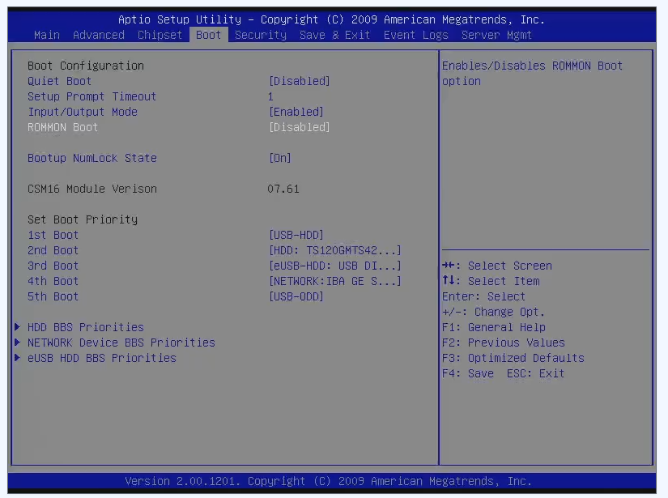
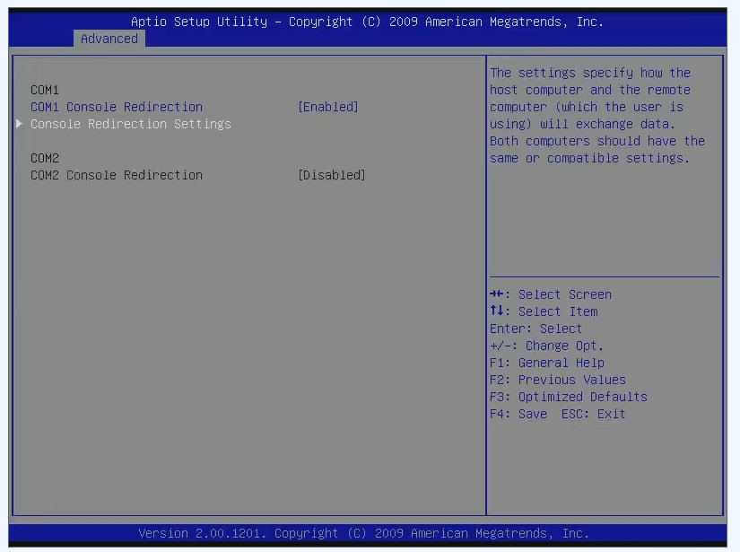
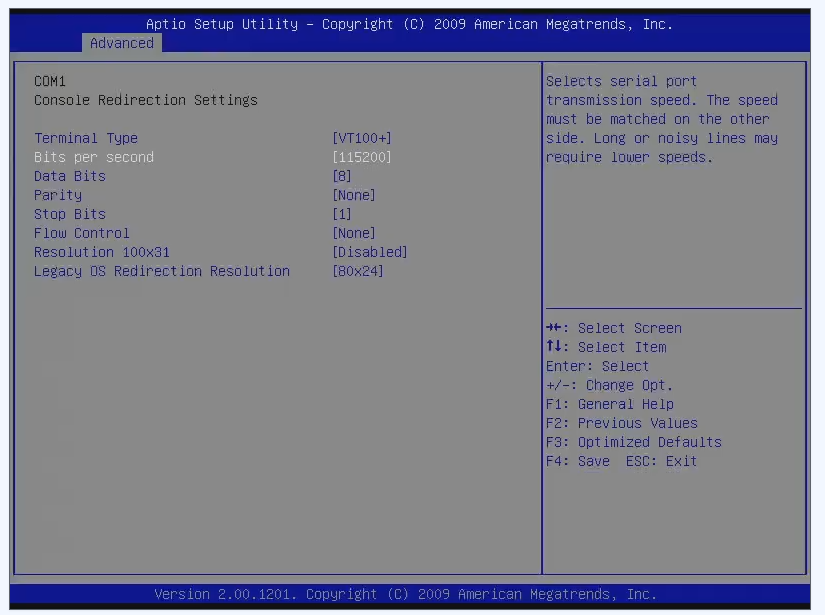

# Reusing a cisco asa 5525x firewall as home server

Reusing a cisco asa 5525x after its EOL as home server.
This is a documentation of my setup process.

> I have no background with this kind of hardware. It is a learning opportunity for me. Don't expect anything to be best practice. 

**Feel free to raise an issue for questions.**

## About the Cisco ASA 5525-x

The Cisco ASA 5525-x is a firewall appliance. Its [end of life](https://www.cisco.com/c/en/us/products/collateral/security/asa-firepower-services/asa5525-5545-5555-1yr-series-subs-eol.html) was in 2025.

It uses standard hardware:
> TBD: Add list of hardware specs

## Additional readings

The [article](https://medium.com/@DomPolizzi/install-opnsense-and-linux-on-cisco-asa-59995dd6d60f) by Domini Polizzi on medium was quite helpful.

## Required additional hardware hardware

- VGA terminal block [Amazon Link](https://www.amazon.de/dp/B07FD3FP61) (optionally an VGA Port HD15F Adapter to IDC16)
- 15 male to female jumper wires
- keyboard
- VGA display and cable
- 2.5" drive
- usb drive to images
- network cable
- power cable
- Cisco Console Cable [Amazon Link](https://www.amazon.de/dp/B0774JV2QQ)

## Disabling ROMMON

ROMMON is a custom firmware from Cisco. It needs to be disabled in the bios. After that it can boot from any drive.

In my case the console output was not redirected to the serial interface. I had to use the VGA header on the mainboard. Please check out the [VGA Header](./VGA-Header.md) page for more information.

On my system the BIOS key is F2. 
> It takes quite some time for the bios splashscreen to show.

In the bios go to boot and disable ROMMON.

## Redirect console to serial

In order not to use the VGA output I used a Cisco console cable to access the system via the serial connection.

To output the BIOS to serial, the console output needs to be redirected to to COM1.

> I used [minicom](https://help.ubuntu.com/community/Minicom) to output the serial data. 

I set the bits per second to 115200 for a faster fresh.

## Ready for your OS

Now it is ready to be used as a server.
- install storage (2.5" drive)
- change boot order
- temporarily disable secure boot
- setup a os

> In my case a graphical OS installer for Ubuntu Desktop 24.04 via the VGA output was not working. Ubuntu server 24.04 was working.

### eUSB

My appliance came with an installed 8GB eUSB module.

- eUSB stands for embedded USB
- The connector is smaller than a standard USB 2 mainboard header and also the pinout is different
- eUSB uses USB2, but more lanes to reach higher speeds

> I will try to install an OS to it later.
