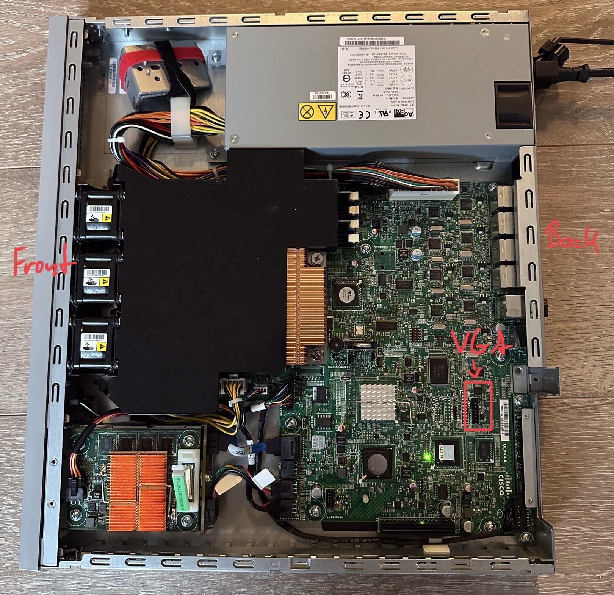

# VGA header

The Cisco ASA 5525x has no VGA HD15F port. Instead it has a VGA header as pins on the mainboard.

I used a VGA terminal block to connect to the VGA header.

> It can take quite some time in the boot sequence before the first image is displayed.

## TL;DR
The mainboard has a VGA header. You can use a IDC16 to VGA Port HD15F adapter or a VGA terminal block.
The pinout of the header is inverted to the VGA pinout. 16->1, 15->2, ..., 2->15

## Locating the header

The VGA header is covered by the extension module.

Closeup:

.jpeg)

## Pinout

The pinout order on the mainboard is inverted to the terminalblock pinout.

|Mainboard (MB) pin | Terminalblock (TB pin)|
|-------------------|-----------------------|
|16                 |1                      |
|15                 |2                      |
|14                 |3                      |
|13                 |4                      |
|12                 |5                      |
|11                 |6                      |
|10                 |7                      |
|9                  |8                      |
|8                  |9                      |
|7                  |10                     |
|6                  |11                     |
|5                  |12                     |
|4                  |13                     |
|3                  |14                     |
|2                  |15                     |

.jpeg)
.jpeg)

## Wired port

.jpeg)

## PoC

.jpeg)